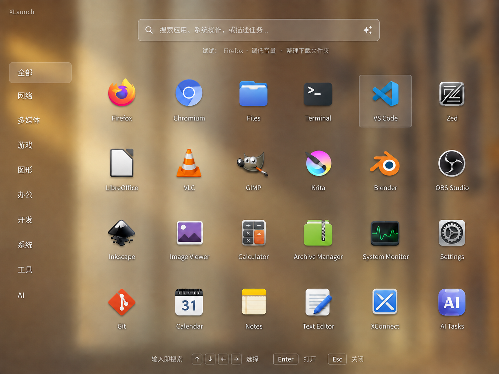

# XLaunch design brief

Date: 2026-09-05. Status: Amber Classic selected by the user; interactive prototype and native adapters are not implemented.

## Identity and outcome

**XLaunch** — Classic desktop, AI commands. Repository: [ai-workspace-lab/XLaunch](https://github.com/ai-workspace-lab/XLaunch), renamed from `xworkspace-console`.

A lightweight launcher for everyday desktop users and developers, combining application search, system actions and natural-language Agent commands. Preserve the 2013 DDE Classic structure: blurred photographic wallpaper, left categories, top search and a dense central grid of colorful dimensional icons.

The selected direction uses warm amber, pale labels with restrained shadows, translucent boundaries and rectangular selection highlights. The 4:3 concept must be recomposed for other viewports rather than stretched. Initial prototype targets: 40–48 logical-pixel search height, 180–210 category width, 14–16 text, 48–64 icons and 6–8 columns when space permits. These are starting design values, not measurements of the generated image. Include opaque backgrounds, larger text, reduced motion and visible keyboard focus.

## Interaction

Empty input shows categories and applications. Typing `Firefox` finds applications; a system-action request identifies its target; a natural-language task such as organizing Downloads opens a task preview with explicit scope. Mixed intent results are labeled application, system action or Agent, and require user selection rather than silently executing a guess.

Natural-language commands work directly; `/ai` may be an optional explicit route. Agent states appear on demand below search or in a shallow task area. No permanent chat sidebar. Agent unavailability must leave local application search usable. Task progress, cancellation and outcomes remain visible; closing the launcher does not silently cancel a task.

Arrow keys select, Enter activates the selected result, Tab traverses controls and Escape backs out of search/preview before closing. Global invocation is configurable and must be checked for platform conflicts.

## Architecture proposal

A desktop-independent core owns normalized app models, categories, ranking, intent results, Agent task state, permission boundaries and preferences. Platform adapters supply invocation, application discovery/opening, system actions, window focus and background effects. No DDE suite, Deepin Store, Linglong or Deepin AI dependency.

The user subsequently named the bottom dock **[XDock](https://github.com/ai-workspace-lab/XDock)** and requested a separate repository. XDock owns pinned apps, running indicators and window switching; XLaunch owns search, categories and commands. Each installs, runs and releases independently, with optional versioned integration. XLaunch can use XDock or the native host dock. The host retains panels and window management; XDock is not embedded in the full-screen launcher.

| Design target | Adapter work to validate |
| --- | --- |
| macOS 26+ | Native app discovery, shortcuts/menu-bar entry, actions, focus and background |
| GNOME 50 | Thin extension or desktop entry; invocation, focus, full-screen behavior and background |
| KDE Plasma 6.6 | Panel widget entry, application discovery, actions and effects |
| DDE 7.0 | Dock/desktop entry using the independent core |
| Xfce | Panel/desktop entry and compositing fallback |

All targets are planned and unverified. Do not assume shared IPC or compositor APIs. Use a blurred local wallpaper copy or solid background when live blur is unavailable. UI toolkit selection remains open; Qt/QML is a candidate for validation. Existing React console functionality remains in place.

## Repository migration and previous design

This updates the launcher direction relative to the [June Xfce desktop design](2026-06-07-ai-workspace-desktop-design.md), which focused on a browser control plane. The current console, installer and desktop configuration remain available; changes to their default startup behavior require implementation work. Existing service names, environment variables, install paths, binary names and release asset names retain `xworkspace-console` for compatibility. GitHub URLs now use `XLaunch`.

## Exploration and provenance

The user selected [Amber Classic](../../../assets/designs/xlaunch/amber-classic-exploration.png); its original old-name mock is retained for history. [Frosted Command](../../../assets/designs/xlaunch/frosted-command-exploration.png) explores unified intent results; [Dusk Workbench](../../../assets/designs/xlaunch/dusk-workbench-exploration.png) explores an on-demand task area. Neither alternative is selected.

The selected image updates the brand to XLaunch. Images were generated with built-in ImageGen, grounded in the [user-supplied 2013 DDE screenshot](../../../assets/designs/xlaunch/dde-2013-reference.png). Icons are conceptual; use real available app icons in implementation. [Generation prompts](../../../assets/designs/xlaunch/prompts.json) are preserved. See the [Chinese brief](../../zh/designs/2026-09-05-xlaunch.md) for the full interaction specification.

Next: an interactive amber prototype covering category filtering, application search, action results, Agent preview, keyboard navigation and empty/unavailable states, with simulated execution explicitly identified; then native per-platform compatibility validation.
